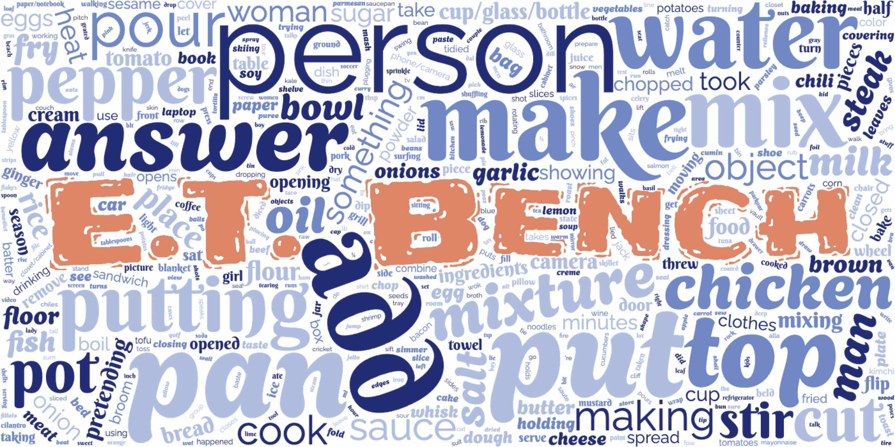
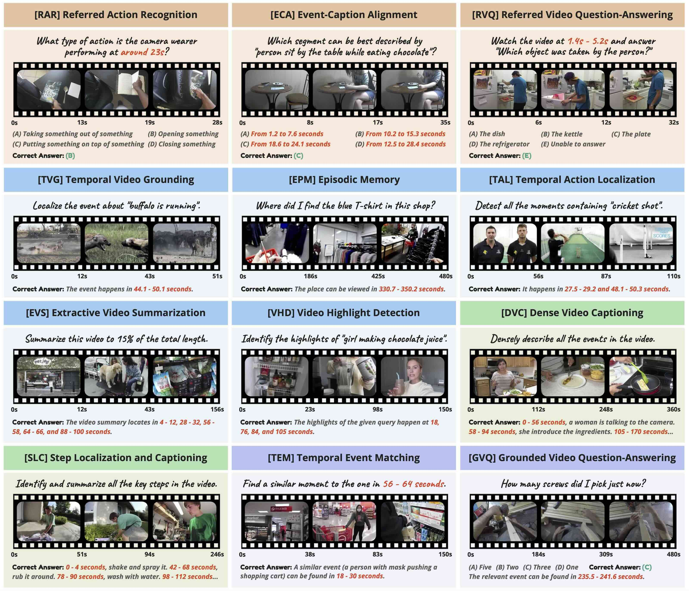
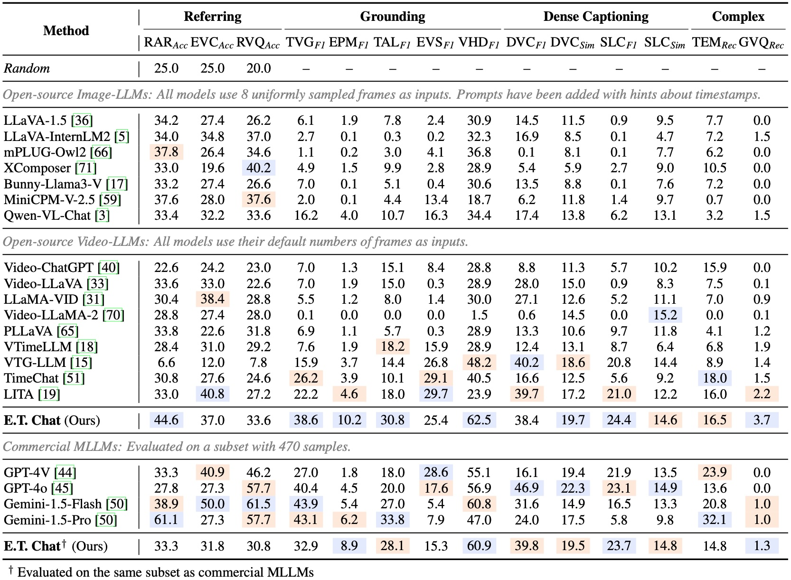

<p align="center">
  
</p>

<h1 align="center">E.T. Bench: Towards Open-Ended Event-Level<br/>Video-Language Understanding</h1>

<p align="center">
  <a href="https://arxiv.org/abs/2409.18111"></a>
  <a href="https://polyu-chenlab.github.io/etbench"></a>
  <a href="https://huggingface.co/datasets/PolyU-ChenLab/ETBench"></a>
  <a href="https://huggingface.co/datasets/PolyU-ChenLab/ET-Instruct-164K"></a>
  <a href="/LICENSE"></a>
</p>

<p align="center">
  <a href="https://yeliu.dev/">Ye Liu</a><sup>1,2</sup>, <a href="https://scholar.google.com/citations?user=qtdueToAAAAJ">Zongyang Ma</a><sup>2,3</sup>, <a href="https://scholar.google.com/citations?user=zJvrrusAAAAJ">Zhongang Qi</a><sup>2</sup>, <a href="https://scholar.google.com/citations?user=T-HaQ84AAAAJ">Yang Wu</a><sup>4</sup>, <a href="https://scholar.google.com/citations?user=4oXBp9UAAAAJ">Ying Shan</a><sup>2</sup>, <a href="https://web.comp.polyu.edu.hk/chencw/">Chang Wen Chen</a><sup>1</sup>
  <p align="center"><sup>1</sup>The Hong Kong Polytechnic University <sup>2</sup>ARC Lab, Tencent PCG<br/><sup>3</sup>Institute of Automation, Chinese Academy of Sciences <sup>4</sup>Tencent AI Lab</p>
</p>

**E.T. Bench** (**E**vent-Level & **T**ime-Sensitive Video Understanding **Bench**mark) is a comprehensive solution for open-ended event-level video-language understanding. This project consists of the following three contributions:

- **E.T. Bench:** A large-scale and high-quality benchmark for event-level and time-sensitive video understanding, comprising 7.3K samples under 12 tasks with 7K videos (251.4h total length) under 8 domains.
- **E.T. Chat:** A multi-modal large language model (MLLM) that specializes in time-sensitive video-conditioned chatting. It reformulates timestamp prediction as a novel embedding matching problem.
- **E.T. Instruct 164K:** A meticulously collected instruction-tuning dataset tailored for time-sensitive video understanding scenarios.

We focus on 4 essential capabilities for time-sensitive video understanding: ***referring***, ***grounding***, ***dense captioning***, and ***complex understanding***. The examples (categorized by background colors) are as follows.

<p align="center"></p>

## 🔥 News

- **`2024.09.28`** ⭐️ Code, model, and dataset release.
- **`2024.09.27`** 🎉 E.T. Bench has been accepted to **NeurIPS 2024 (Datasets and Benchmarks Track)**.

## 🏆 Leaderboard

Our online leaderboard is under construction. Stay tuned!

<p align="center">
  
</p>

## 🔮 Benchmark

Please refer to the [Benchmark](docs/BENCHMARK.md) page for details about E.T. Bench.

## 🛠️ Model

Please refer to the [Model](docs/MODEL.md) page for training and testing E.T. Chat.

## 📦 Dataset

Please refer to the [Dataset](docs/DATASET.md) page for downloading E.T. Instruct 164K.

## 📖 Citation

Please kindly cite our paper if you find this project helpful.

```bibtex
@inproceedings{liu2024etbench,
  title={E.T. Bench: Towards Open-Ended Event-Level Video-Language Understanding},
  author={Liu, Ye and Ma, Zongyang and Qi, Zhongang and Wu, Yang and Chen, Chang Wen and Shan, Ying},
  booktitle={Neural Information Processing Systems (NeurIPS)},
  year={2024}
}
```

## 💡 Acknowledgements

This project was built upon the following repositories with many thanks to their authors.

[LLaVA](https://github.com/haotian-liu/LLaVA), [LAVIS](https://github.com/salesforce/LAVIS), [EVA](https://github.com/baaivision/EVA), [LLaMA-VID](https://github.com/dvlab-research/LLaMA-VID), [TimeChat](https://github.com/RenShuhuai-Andy/TimeChat), [densevid_eval](https://github.com/ranjaykrishna/densevid_eval)
