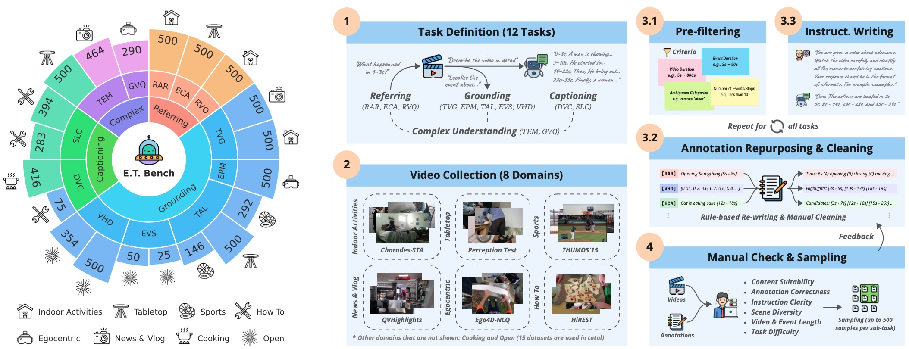

# E.T. Bench

<p align="center">
  
</p>

E.T. Bench is a large-scale and high-quality benchmark for open-ended event-level video understanding. Categorized within a 3-level task taxonomy, it encompasses 7.3K samples under 12 tasks with 7K videos (251.4h total length) under 8 domains, providing comprehensive evaluations on 4 essential capabilities for time-sensitive video understanding.

## 📦 Data Preparation

The evaluation kit for E.T. Bench is hosted on [Hugging Face](https://huggingface.co/datasets/PolyU-ChenLab/ETBench). You may download it using the following command.

```shell
git lfs install
git clone git@hf.co:datasets/PolyU-ChenLab/ETBench
```

Then, enter the directory and extract the files in the `videos` folder by running:

```shell
cd ETBench
for path in videos/*.tar.gz; do tar -xvf $path -C videos; done
```

**[Optional]** You may also want to compress the videos (to lower FPS & resolution) for faster I/O.

```shell
python compress_videos.py --fps 3 --size 224
```

<details>
<summary><i>Arguments of <code>compress_videos.py</code></i></summary>
<br>

- `--src_dir` Path to the videos folder (Default: `videos`)
- `--tgt_dir` Path to the output folder (Default: `videos_compressed`)
- `--fps` The target FPS for output (Default: `3`)
- `--size` The length of the shortest side of output frames (Default: `224`)
- `--workers` Number of workers to use (Default: `None` same as the number of CPUs)

</details>

This will compress all the videos to `3 FPS` and `224 pixels shortest side`. The audio will be removed as well. The output videos will be saved in `videos_compressed` folder with the same structure as `videos`.

## 🚀 Getting Started

The folder for E.T. Bench is organized as follows.

```
ETBench
├─ annotations
│  ├─ txt (annotations for sub-tasks, with timestamps as text)
│  ├─ vid (annotations for sub-tasks, with timestamps as <vid> tokens)
│  ├─ etbench_txt_v1.0.json (merged annotations in `txt` folder)
│  └─ etbench_vid_v1.0.json (merged annotations in `vid` folder)
├─ evaluation
│  ├─ compute_metrics.py (script for computing metrics)
│  ├─ requirements.txt (requirements for the evaluation script)
│  └─ subset.json (IDs of the subset for evaluating commercial models)
├─ videos (raw video files)
├─ videos_compressed (compressed video files)
└─ compress_videos.py (script for compressing videos)
```

For full evaluation on 7,289 samples, you just need to use either of the following annotation file.

- `etbench_txt_v1.0.json` - for models representing timestamps in pure text, e.g., '2.5 - 4.8 seconds'
- `etbench_vid_v1.0.json` - for models using special tokens for timestamps, e.g., \<vid\> token in E.T. Chat

Each JSON file contains a list of dicts with the following entries.

```python
{
  "version": 1.0,                       # annotation version
  "idx": 0,                             # sample index
  "task": "tvg",                        # task
  "source": "qvhighlights",             # source dataset
  "video": "qvhighlights/example.mp4",  # path to video
  "duration": 35.0,                     # video duration (seconds)
  "src": [1.2, 15.0],                   # [optional] timestamps (seconds) in model inputs
  "tgt": [[15.0, 31.0], [31.4, 34.9]],  # [optional] timestamps (seconds) in model outputs
  "p": 0,                               # [optional] index of correct answer (for RAR, ECA, RVQ, GVQ)
  "o": ["a", "b", "c", "d"],            # [optional] answer candidates (for RAR, ECA, RVQ, GVQ)
  "g": ["a cat...", "it then..."],      # [optional] ground truth captions (for DVC, SLC)
  "q": "...",                           # model input prompt
  "a": "..."                            # [to be added by the user] model response
}
```

For each sample, you can simply load the corresponding video and send it together with the prompt in `q` to the model. In `vid` style annotations, all the timestamps in `q` have been replaced with `<vid>` and their original values can be found in `src`.

After obtaining model outputs, you need to place raw text responses into the `a` entries of each sample and dump the entire list to a new JSON file. ***Please make sure the dumped file has exactly the same structure as the annotation file, except that each sample has a new `a` entry storing model outputs.***

Please refer to the [inference script](../etchat/eval/infer_etbench.py) of E.T. Chat as an example.

## 🔮 Compute Metrics

Run the following command to install the requirements for the evaluation script.

```shell
pip install -r evaluation/requirements.txt
```

After that, compute the metrics by running

```shell
python evaluation/compute_metrics.py <path-to-the-dumped-json>

# In case you want to evaluate on the subset with 470 samples (same as the commercial models in Table 1 of the paper)
# python evaluation/compute_metrics.py <path-to-the-dumped-json> --subset
```

The evaluation log and computed metrics will be saved in `metrics.log` and `metrics.json`, respectively.
