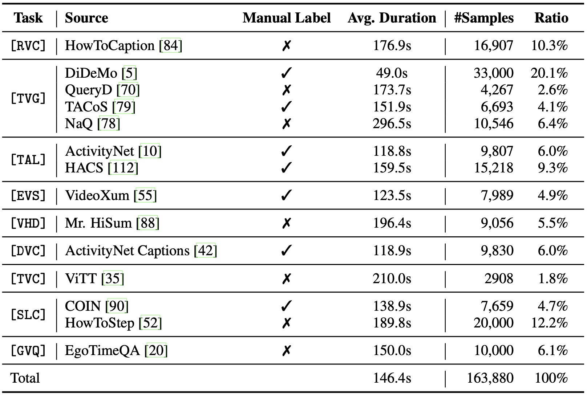

# E.T. Instruct 164K

<p align="center">
  
</p>

E.T. Instruct 164K is a large-scale instruction-tuning dataset tailored for fine-grained event-level and time-sensitive video understanding. It contains 101K meticulously collected videos under diverse domains and 9 event-level understanding tasks with well-designed instruction-response pairs. The average video length is around 146 seconds.

## 📦 Download Dataset

The E.T. Instruct 164K dataset is hosted on [Hugging Face](https://huggingface.co/datasets/PolyU-ChenLab/ET-Instruct-164K). You may download it using the following command.

```shell
git lfs install
git clone git@hf.co:datasets/PolyU-ChenLab/ET-Instruct-164K
```

Then, enter the directory and extract the files in the `videos` folder by running:

```shell
cd ET-Instruct-164K
for path in videos/*.tar.gz; do tar -xvf $path -C videos; done
```

All the videos have been processed to `3 FPS` and `224 pixels shortest side`. The audio has been removed as well. 

## 🚀 Getting Started

We provide two types of annotations (`txt` and `vid`), whose difference is illustrated below.

- `et_instruct_164k_txt.json` - for models representing timestamps in pure text, e.g., '2.5 - 4.8 seconds'
- `et_instruct_164k_vid.json` - for models using special tokens for timestamps, e.g., \<vid\> token in E.T. Chat

Each JSON file contains a list of dicts with the following entries.

```python
{
  "task": "slc",                           # task
  "source": "how_to_step",                 # source dataset
  "video": "how_to_step/PJi8ZEHAFcI.mp4",  # path to video
  "duration": 200.767,                     # video duration (seconds)
  "src": [12, 18],                         # [optional] timestamps (seconds) in model inputs
  "tgt": [36, 44, 49, 57],                 # [optional] timestamps (seconds) in model outputs
  "conversations": [                       # conversations
    {
      "from": "human",
      "value": "<image>\n..."
    },
    {
      "from": "gpt",
      "value": "..."
    }
  ]
}
```

In `vid` style annotations, all the timestamps in `conversations` have been replaced with `<vid>` and their original values can be found in `src` (for human messages) and `tgt` (for gpt messages).
