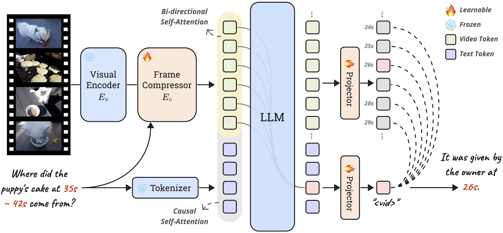

# E.T. Chat

<p align="center">
  
</p>

E.T. Chat is a novel time-sensitive Video-LLM that reformulates timestamp prediction as an embedding matching problem, serving as a strong baseline on E.T. Bench. E.T. Chat consists of a visual encoder $E_v$, a frame compressor $E_c$, and a LLM. A special token \<vid\> is introduced to trigger frame embedding matching for timestamp prediction.

## 🛠️ Installation

Please refer to the following environmental settings that we use. You may install these packages by yourself if you meet any problem during automatic installation.

- CUDA 11.8
- Python 3.12.2
- PyTorch 2.4.0
- [Transformers](https://github.com/huggingface/transformers) 4.44.2
- [DeepSpeed](https://github.com/microsoft/DeepSpeed) 0.14.5
- [NNCore](https://github.com/yeliudev/nncore) 0.4.5

### Install from source

1. Clone the repository from GitHub.

```shell
git clone https://github.com/PolyU-ChenLab/ETBench.git
cd ETBench
```

2. Initialize conda environment.

```shell
conda create -n etchat python=3.12 -y
conda activate etchat
```

3. Install dependencies.

```shell
pip install -r requirements.txt
```

## 🚀 Getting Started

We apply a three-stage training receipe for E.T. Chat, where the first stage is for modality alignment, the second stage is for acquiring general chatting abilities, and the third stage is for enhancing time-sensitive chatting abilities.

### Prepare model checkpoints

We compare the learnable modules in each stage, and provide their checkpoints as follows.

|| Encoder | Q-Former | Aggregator | Projector | LLM (LoRA) | Checkpoint |
|-|:-:|:-:|:-:|:-:|:-:|:-:|
| `Stage-1` | ❄️ | ❄️ | 🔥 | 🔥 | ❄️ | [](https://huggingface.co/PolyU-ChenLab/ETChat-Phi3-Mini-Stage-1) |
| `Stage-2` | ❄️ | 🔥 | 🔥 | 🔥 | 🔥 | [](https://huggingface.co/PolyU-ChenLab/ETChat-Phi3-Mini-Stage-2) |
| `Stage-3` | ❄️ | 🔥 / ❄️ | 🔥 | 🔥 | 🔥 | [](https://huggingface.co/PolyU-ChenLab/ETChat-Phi3-Mini-Stage-3) |

If you want to start from `stage-1`, the pre-trained weights from [Phi3-Mini-4K-Instruct](https://huggingface.co/microsoft/Phi-3-mini-4k-instruct), [EVA-ViT-G](https://storage.googleapis.com/sfr-vision-language-research/LAVIS/models/BLIP2/eva_vit_g.pth), and [Q-Former](https://storage.googleapis.com/sfr-vision-language-research/LAVIS/models/InstructBLIP/instruct_blip_vicuna7b_trimmed.pth) are required for initializing the model. The downloaded checkpoints shall be saved in the `model_zoo` folder.

### Prepare datasets

The training data used in each stage is summarized as follows. We follow the same setting as [LLaMA-VID](https://github.com/dvlab-research/LLaMA-VID) in `Stage-1` and `Stage-2`, while an additional `stage-3` is introduced together with the new E.T. Instruct 164K dataset.

|| Video Data | Image Data | Annotations |
|-|-|-|-|
| `Stage-1` | [WebVid](https://maxbain.com/webvid-dataset/) | [LCS-558K](https://huggingface.co/datasets/liuhaotian/LLaVA-Pretrain) | [llava_558k_with_webvid.json](https://huggingface.co/datasets/YanweiLi/LLaMA-VID-Data/resolve/main/llava_558k_with_webvid.json) |
| `Stage-2` | [ActivityNet](http://activity-net.org/download.html) / [VideoChatGPT](https://mbzuaiac-my.sharepoint.com/:f:/g/personal/hanoona_bangalath_mbzuai_ac_ae/EnLRDehrr8lGqHpC5w1zZ9QBnsiVffYy5vCv8Hl14deRcg?e=Ul5DUE) | [LLaVA-1.5-Instruct](https://github.com/haotian-liu/LLaVA?tab=readme-ov-file#visual-instruction-tuning) | [llava_v1_5_mix665k_with_video_chatgpt.json](https://huggingface.co/datasets/YanweiLi/LLaMA-VID-Data/resolve/main/llava_v1_5_mix665k_with_video_chatgpt.json) |
| `Stage-3` | [ET-Instruct-164K](https://huggingface.co/datasets/PolyU-ChenLab/ET-Instruct-164K) | - | [et_instruct_164k_vid.json](https://huggingface.co/datasets/PolyU-ChenLab/ET-Instruct-164K/resolve/main/et_instruct_164k_vid.json) |

Download the required datasets and place them in the `data` folder. It is strongly recommended to compress the videos (to `3 FPS` & `224ss`) using the [script](https://huggingface.co/datasets/PolyU-ChenLab/ETBench/blob/main/compress_videos.py) provided in E.T. Bench. After processing, make sure the files are organized in the following structure.

```
ETBench
├─ data
│  ├─ llamavid
│  │  ├─ llava_558k_with_webvid.json
│  │  └─ llava_v1_5_mix665k_with_video_chatgpt.json
│  ├─ llava_pretrain                 ─┐
│  │  └─ images                       │ For
│  ├─ webvid                          │ Stage-1
│  │  └─ videos                      ─┘
│  ├─ llava_instruct                 ─┐
│  │  ├─ coco                         │
│  │  ├─ gqa                          │
│  │  ├─ ocr_vqa                      │ For
│  │  ├─ textvqa                      │ Stage-2
│  │  └─ vg                           │
│  ├─ video_chatgpt                   │
│  │  └─ activitynet                 ─┘
│  ├─ et_instruct_164k               ─┐
│  │  ├─ videos                       │ For
│  │  ├─ et_instruct_164k_txt.json    │ Stage-3
│  │  └─ et_instruct_164k_vid.json   ─┘
│  ├─ etbench                        ─┐
│  │  ├─ annotations                  │ For
│  │  ├─ videos                       │ Evaluation
│  │  └─ videos_compressed           ─┘
├─ model_zoo
│  ├─ Phi-3-mini-4k-instruct
│  ├─ eva_vit_g.pth
│  └─ instruct_blip_vicuna7b_trimmed.pth
├─ etchat
├─ scripts
└─ README.md
```

## 🔮 Training

Use the following commands to train E.T. Chat. The default setting is to use 8 * NVIDIA V100 (32G) GPUs. You may modify `nproc_per_node`, `per_device_train_batch_size`, and `gradient_accumulation_steps` to keep the same global batch size if you have different device configurations.

```shell
# Stage-1 (around 6 hours on 8*V100)
bash scripts/train_stage_1.sh

# Stage-2 (around 32 hours on 8*V100)
bash scripts/train_stage_2.sh [<path-to-stage-1-checkpoint>]

# Stage-3 (around 20 hours on 8*V100)
bash scripts/train_stage_3.sh [<path-to-stage-2-checkpoint>]
```

The training logs and checkpoints will be saved in the `work_dirs` folder.

## 💻 Inference

Use the following command to run inference on E.T. Bench.

```shell
bash scripts/inference.sh [<path-to-checkpoint>]
```

This will start 8 processes (on one GPU each) and generate 8 JSON files in the `<path-to-checkpoint>/etbench` folder. You may pass the path to this folder to E.T. Bench's [evaluation script](https://huggingface.co/datasets/PolyU-ChenLab/ETBench/tree/main/evaluation) to compute metrics.

```shell
python compute_metrics.py <path-to-checkpoint>/etbench
```
